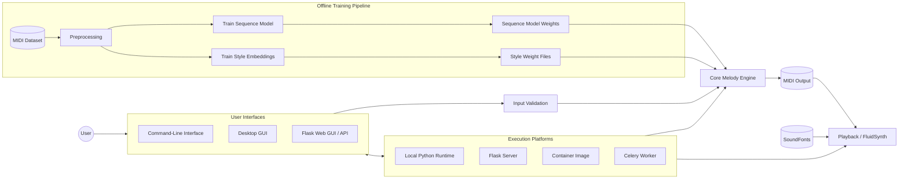

<!--
File: README_ARCHITECTURE.md
Purpose: Provide a high-level architecture overview for the Melody Generator project, including interfaces, core engine modules, platforms, data sources, and API interactions.
Usage: View in Markdown renderers that support Mermaid to visualize component relationships.
Assumptions: Diagram abstracts implementation details; consult module docs for specifics.

Update: Consolidated runtime and training views into a single left-to-right flowchart, added user and platform nodes, and clarified how offline artifacts feed the core engine.
-->

# Architecture Overview

This document outlines the major components of the Melody Generator system and how they interact. It is intended to give newcomers context on the project's structure and supported platforms.

The consolidated diagram above illustrates the full lifecycle. The left portion shows the offline training pipeline that generates sequence-model weights and style-embedding files. These artifacts flow into the core melody engine at runtime, where users interact through command-line, desktop, or web interfaces. Input parameters are first sanitized by the validation layer before the core engine orchestrates harmony, rhythm, sequence modeling, and style embeddings. The engine emits MIDI data, which can be rendered through FluidSynth or saved for later use. Soundfonts feed directly into the playback stage, while the various execution platforms host both interface and playback components as needed.
