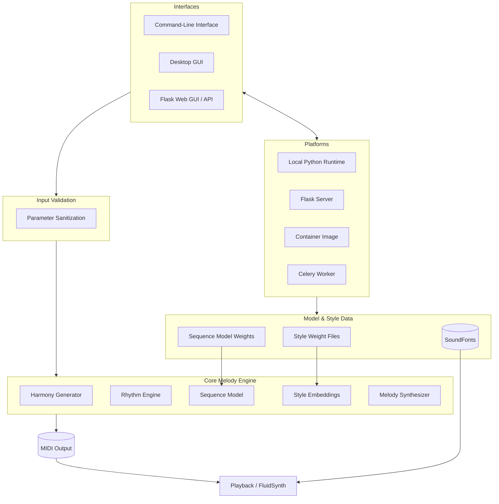
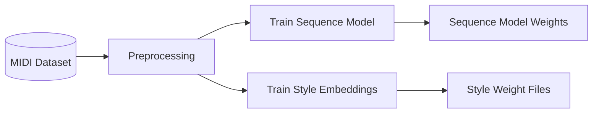

<!--
File: README_ARCHITECTURE.md
Purpose: Provide a high-level architecture overview for the Melody Generator project, including interfaces, core engine modules, platforms, data sources, and API interactions.
Usage: View in Markdown renderers that support Mermaid to visualize component relationships.
Assumptions: Diagram abstracts implementation details; consult module docs for specifics.

Update: Expanded the diagram and explanations to cover the validation layer, model and style data inputs, optional Celery worker, and the training pipeline that produces model artifacts.
-->

# Architecture Overview

This document outlines the major components of the Melody Generator system and how they interact. It is intended to give newcomers context on the project's structure and supported platforms.

The CLI and desktop GUI execute locally, while the web interface exposes a REST-style API served by Flask. All interfaces route through a validation layer that sanitizes user parameters before invoking the core melody engine. The engine orchestrates harmony, rhythm, sequence modeling, and style embeddings, drawing on external model and style data. It produces MIDI for playback or export, optionally previewed via FluidSynth. Model weights, style files, and soundfonts live outside the engine but are loaded on demand.

Training artifacts such as sequence model weights and style embeddings are produced offline. The runtime architecture above consumes these generated files to bias note selection and timbre.
