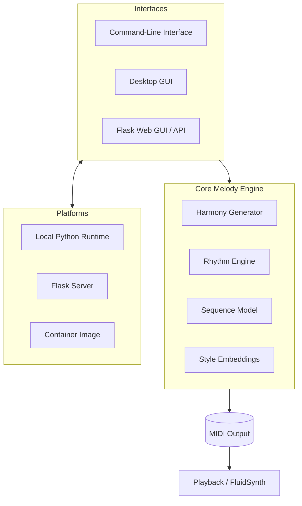

<!--
File: README_ARCHITECTURE.md
Purpose: Provide a high-level architecture overview for the Melody Generator project, including interfaces, core engine modules, platforms, and API interactions.
Usage: View in Markdown renderers that support Mermaid to visualize component relationships.
Assumptions: Diagram abstracts implementation details; consult module docs for specifics.
-->

# Architecture Overview

This document outlines the major components of the Melody Generator system and how they interact. It is intended to give newcomers context on the project's structure and supported platforms.

The CLI and desktop GUI execute locally, while the web interface exposes a REST-style API served by Flask. All interfaces delegate to the same core melody engine, which orchestrates harmony, rhythm, sequence modeling, and style embeddings before emitting MIDI for playback or export.
